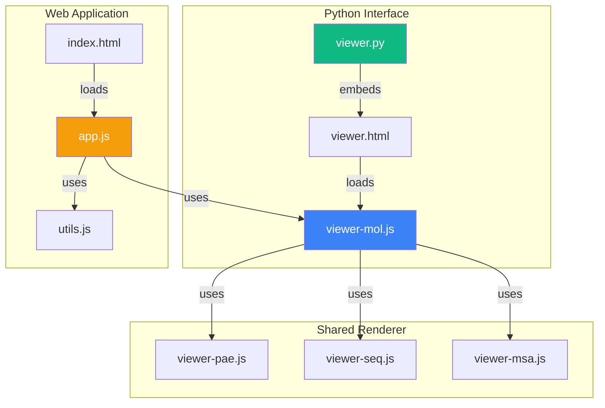
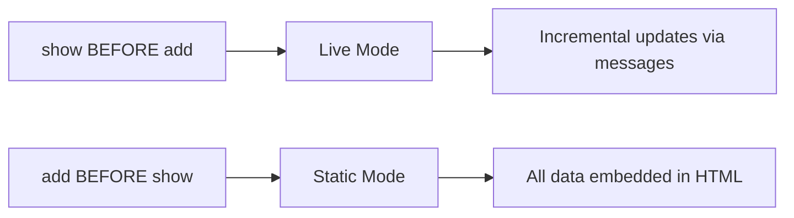

# py2Dmol Technical Reference (AI-Optimized)

**Purpose**: Complete technical documentation for AI systems and developers working with py2Dmol codebase.

**Last Updated**: 2025-11-28

---

## Quick Navigation

- [Architecture Overview](#architecture-overview)
- [File Structure](#file-structure)
- [Python Interface](#python-interface)
- [JavaScript Interface](#javascript-interface)
- [Data Flow](#data-flow)
- [Rendering System](#rendering-system)
- [Function Reference](#function-reference)

---

## Architecture Overview

### System Components

py2Dmol has **two independent interfaces** that share the same renderer:

1. **Python Package** (`py2Dmol/`) - Jupyter/Colab widget
2. **Web Application** (`web/` + `index.html`) - Standalone browser app



### Technology Stack

| Layer | Technology | Purpose |
|-------|-----------|---------|
| **Python** | numpy, gemmi, IPython | Data processing, PDB/CIF parsing, Jupyter integration |
| **Rendering** | HTML5 Canvas (2D) | Pseudo-3D visualization (NOT WebGL) |
| **Alignment** | numeric.js (SVD) | Kabsch algorithm, PCA-based best view |
| **File Parsing** | gemmi (Python), custom JS parsers | PDB/CIF/MSA parsing |
| **UI Framework** | Vanilla JS + TailwindCSS | No heavy frameworks |

### Key Design Decisions

1. **Canvas-Based Rendering**: Uses 2D canvas with pseudo-3D projection (NOT WebGL)
2. **Two-Mode System**: Static (all data at once) vs Live (incremental updates)
3. **Per-Object State**: Each object has independent rotation, color, visibility
4. **Message Passing**: Python → JavaScript via `display(Javascript(...))`
5. **No Server**: All processing happens client-side (browser or notebook)

---

## File Structure

```
py2Dmol/
├── py2Dmol/                     # Python Package
│   ├── viewer.py                # Main Python interface (1,971 lines)
│   └── resources/
│       ├── viewer.html          # Jupyter widget template (606 lines)
│       ├── viewer-mol.js        # CORE: Pseudo3DRenderer (6,791 lines)
│       ├── viewer-pae.js        # PAE matrix visualization (906 lines)
│       ├── viewer-seq.js        # Sequence viewer (2,257 lines)
│       └── viewer-msa.js        # MSA viewer (4,702 lines)
│
├── web/                         # Web Application
│   ├── app.js                   # Web app logic (6,485 lines)
│   ├── utils.js                 # Utilities: parsing, alignment (2,797 lines)
│   └── style.css                # Global styles
│
├── index.html                   # Main web app entry (450 lines)
├── msa.html                     # Standalone MSA viewer (231 lines)
└── README.md                    # User documentation
```

### File Headers (AI Context)

Every major file has an AI-friendly header:

```javascript
// ============================================================================
// py2Dmol/resources/viewer-mol.js
// -------------------------------
// AI Context: CORE RENDERER (Pseudo3DRenderer)
// - This is the heart of the visualization.
// - Implements `Pseudo3DRenderer` class.
// - Handles 3D projection, Z-sorting, and canvas drawing.
// ============================================================================
```

---

## Python Interface

### Entry Point: `viewer.py`

**Path**: `py2Dmol/viewer.py`  
**Class**: `view`  
**Lines**: 1,934

#### Core Responsibilities

1. Manages list of objects and frames
2. Serializes data to JSON for frontend
3. Generates HTML/JS for Jupyter embedding
4. Implements live mode communication bridge

#### Constructor: `view.__init__()`

```python
def __init__(self,
    size=(400,400),           # Canvas size (width, height)
    controls=True,            # Show control UI
    box=True,                 # Show bounding box
    color="auto",             # Color mode
    colorblind=False,         # Colorblind-safe palette
    pastel=0.25,              # Pastel saturation (0.0-1.0)
    shadow=True,              # Enable/disable shadows
    outline="full",           # Outline mode: "full", "partial", "none"
    width=3.0,                # Line width (2.0-4.7)
    ortho=1.0,                # Ortho projection (0=perspective, 1=ortho)
    rotate=False,             # Auto-rotate
    autoplay=False,           # Auto-play animation
    pae=False,                # Show PAE matrix
    pae_size=300,             # PAE canvas size
    reuse_js=False,           # Reuse JS (optimization)
    overlay=False             # Overlay all frames
):
```


#### Key State Variables

```python
self.objects = []                    # List of object dictionaries
self._current_object_data = None     # Current object's frame list
self._is_live = False               # Live mode flag
self.config = {}                     # Viewer configuration

# Alignment state (per-object)
self._coords = None
self._plddts = None
self._chains = None
self._position_types = None
self._pae = None
self._position_names = None
self._position_residue_numbers = None
```

**Important**: NO `self.rotation_matrix` - rotation is managed client-side per-object.

#### Primary Functions

##### `add(coords, plddts, chains, ...)`

Adds a frame to the current object.

```python
def add(self,
    coords,                   # Nx3 numpy array
    plddts=None,              # N-length pLDDT scores
    chains=None,              # N-length chain IDs
    position_types=None,      # N-length types: P/D/R/L
    pae=None,                 # LxL PAE matrix
    name=None,                # Object name (auto-creates new obj if different)
    align=True,               # Auto-align to first frame
    position_names=None,      # Residue names
    residue_numbers=None,     # PDB resSeq
    atom_types=None,          # Deprecated: use position_types
    contacts=None,            # Contact restraints
    bonds=None,               # Explicit bonds
    color=None                # Color override
):
```

**No `new_obj` parameter** - objects are created automatically when `name` changes.

##### `add_pdb(filepath, chains, name, ...)`

Loads structure from PDB/CIF file.

```python
def add_pdb(self,
    filepath,                 # Path to .pdb or .cif
    chains=None,              # Chain IDs to load
    name=None,                # Object name (auto-creates if different)
    paes=None,                # PAE matrices (one per model)
    align=True,               # Auto-align
    use_biounit=False,        # Load biological assembly
    biounit_name="1",         # Assembly name
    load_ligands=True,        # Load ligands
    contacts=None,            # Contact restraints
    color=None                # Color override
):
```

**No `new_obj` parameter**.

##### `from_pdb(pdb_id, ...)`

Convenience function: downloads from RCSB if 4-char code.

```python
def from_pdb(self,
    pdb_id,                   # 4-char code or filepath
    chains=None,
    name=None,                # Auto-generated if None
    align=True,               # Default: True (not False)
    use_biounit=False,
    biounit_name="1",
    load_ligands=True,
    contacts=None,
    color=None,
    ignore_ligands=None       # Deprecated parameter (backward compat)
):
```

**Default `align=True`** (not `False`).

##### `from_afdb(uniprot_id, ...)`

Loads from AlphaFold DB.

##### `show()`

Displays the viewer.

- Called **before** `add()`: Creates empty live viewer
- Called **after** `add()`: Creates static viewer with all data

##### `save_state(filepath)` / `load_state(filepath)`

Save/restore complete viewer state to JSON.

#### Static vs Live Mode



**Static Mode**: `add()` → `show()`
- All data embedded in `window.py2dmol_staticData[viewer_id]`
- Single HTML output

**Live Mode**: `show()` → `add()`
- Updates sent via `display(Javascript(...))`
- Messages handled by `window.py2dmol_viewers[viewer_id]`

---

## JavaScript Interface

### Core Renderer: `viewer-mol.js`

**Path**: `py2Dmol/resources/viewer-mol.js`  
**Class**: `Pseudo3DRenderer`  
**Lines**: 6,711

#### Global Registry

```javascript
window.py2dmol_viewers = {};          // All viewer instances by ID
window.py2dmol_staticData = {};       // Static data keyed by viewer_id
window.viewerConfig = {};             // Current config
window.viewerApi = null;              // Reference to main renderer API
```

#### Pseudo3DRenderer Class

**Class Methods**:
- `constructor(canvas)` - Initialize renderer (reads config from `window.viewerConfig`)
- `addObject(name)` - Create empty object
- `addFrame(data, objectName)` - Add frame to object
- `setFrame(frameIndex, skipRender)` - Switch frame
- `render(reason)` - Main render loop

**Public API** (exposed via `window.py2dmol_viewers[viewer_id]`):

The viewer exposes an API object containing:
- `handlePythonUpdate` - Process live frame updates from Python
- `handlePythonNewObject` - Handle new object creation from Python
- `handlePythonSetObjectColor` - Update object color from Python
- `handlePythonSetColor` - Update global color mode from Python
- `handlePythonSetViewTransform` - Update rotation/center from Python
- `handlePythonClearAll` - Clear all objects from Python
- `handlePythonResetAll` - Reset viewer state from Python
- `renderer` - Reference to the Pseudo3DRenderer instance

**Per-Object State** (stored in `this.objectsData[name].viewerState`):
```javascript
{
    rotation: [[1, 0, 0], [0, 1, 0], [0, 0, 1]],  // 3x3 rotation matrix
    zoom: 1.0,                                     // Zoom level
    perspectiveEnabled: false,                     // Enable/disable perspective projection
    focalLength: 200.0,                            // Focal length for perspective
    center: null,                                  // Rotation center (computed)
    extent: null,                                  // Object extent (computed)
    currentFrame: -1                               // Active frame index (-1 = none)
}
```

#### Rendering Pipeline

The `render()` method (viewer-mol.js:5032) follows this high-level flow:

```javascript
// 1. Apply rotation matrix to all coordinates
rotatedCoords = coords.map(c => applyRotation(c, viewerState.rotation))

// 2. Project 3D coordinates to 2D screen space
//    Uses inline projectPosition function with orthographic/perspective blend
for each position:
    screen[i] = project(rotatedCoords[i], zoom, ortho, focalLength)

// 3. Build segment array from bonds/contacts
//    Each segment stores: idx1, idx2, depth, color, type
for each bond:
    segment = {idx1, idx2, depth: avgZ, color, positionType}
    segments.push(segment)

// 4. Depth sort (painter's algorithm)
segments.sort((a, b) => a.depth - b.depth)

// 5. Grid-based culling (optional, for large molecules)
//    Keeps top N segments per 2D grid cell for performance
if (positions > LARGE_MOLECULE_CUTOFF):
    segments = cullByGrid(segments)

// 6. Draw in two passes: outline then main
for each segment:
    if (outline): drawLine(ctx, thicker, darker)
    drawLine(ctx, thinner, color)

// 7. Apply shadows (grid-based shadow map)
//    Darkens segments below the max Z in their grid cell
```

### Web App: `app.js`

**Path**: `web/app.js`  
**Lines**: 6,496

#### Initialization Flow

```javascript
DOMContentLoaded → initializeApp() → {
    1. initializeViewerConfig()       // Create window.viewerConfig
    2. setupCanvasDimensions()        // Set canvas 600x600
    3. initializePy2DmolViewer()      // Create Pseudo3DRenderer
    4. Get viewerApi reference        // window.py2dmol_viewers[id]
    5. Setup MSA callbacks            // If MSAViewer exists
    6. setupEventListeners()          // Wire 60+ UI handlers
    7. initDragAndDrop()              // File drag/drop
    8. setStatus("Ready...")          // Display message
}
```

#### Key Functions

- `handleFetch()` - Fetch from PDB/AlphaFold
- `handleFileUpload(event)` - Process file uploads
- `handleObjectChange()` - Switch active object
- `setupEventListeners()` - Wire all UI events

### Utilities: `utils.js`

**Path**: `web/utils.js`  
**Lines**: 2,797

#### Key Functions

##### Alignment

```javascript
function calculateMean(coords)
// Returns: [mean_x, mean_y, mean_z]

function kabsch(A, B)
// A, B: Nx3 centered arrays
// Returns: 3x3 rotation matrix
// Uses: numeric.svd() for SVD decomposition

function align_a_to_b(fullCoordsA, alignCoordsA, alignCoordsB)
// Aligns A to B using subset of coordinates
```

##### Best View

```javascript
function bestViewTargetRotation_relaxed_AUTO(coords, currentRotation, canvasWidth, canvasHeight)
// Uses PCA (SVD on covariance) to find optimal rotation
// Maps largest variance to longest canvas dimension
```

##### Parsing

```javascript
function parsePDB(text)
// Returns: { models, modresMap, conectMap }
// Parses: ATOM, HETATM, CONECT, MODRES records

function parseCIF(text)
// Returns: Array of models
// Parses: _atom_site, _struct_conn, _chem_comp_bond
```

---

## Data Flow

### Static Mode

```
Python                           JavaScript
──────────────────────────────────────────────
viewer.add() ────────┐
viewer.add() ────────┼─→ [Objects with frames]
viewer.show() ───────┘
    │
    ├─→ Serialize to JSON
    ├─→ Embed in HTML as:
    │   window.py2dmol_staticData[viewer_id] = {...}
    └─→ Browser loads complete HTML
            │
            ├─→ Parse py2dmol_staticData
            └─→ initializePy2DmolViewer()
                    │
                    └─→ Render all frames
```

### Live Mode

```
Python                           JavaScript
──────────────────────────────────────────────
viewer.show() ────→ Empty viewer initialized
    │                       │
    │                       └─→ window.py2dmol_viewers[id]
    │
viewer.add() ─────→ _send_message()
    │                       │
    ├─→ Serialize frame     │
    ├─→ Create JS:          │
    │   "window.py2dmol_viewers[id]
    │    .handlePythonUpdate(payload)"
    │                       │
    └─→ display(Javascript(...))
                            │
                            └─→ Renderer processes update
                                    │
                                    └─→ Immediate re-render
```

### Message Protocol

#### `py2DmolUpdate`

**Sent by**: `add()` in live mode

```python
{
    "type": "py2DmolUpdate",
    "name": "object_name",
    "payload": {
        "coords": [[x, y, z], ...],
        "plddts": [50, 60, ...],
        "chains": ["A", "B", ...],
        "position_types": ["P", "P", ...],
        "pae": [uint8, uint8, ...] or None,
        "position_names": ["ALA", ...],
        "residue_numbers": [1, 2, ...],
        "bonds": [[0, 1], [1, 2]],
        "contacts": [[10, 50, 1.0, {r, g, b}], ...],
        "color": {"type": "mode", "value": "plddt"}
    }
}
```

#### `py2DmolNewObject`

**Sent by**: `new_obj()` in live mode

```python
{
    "type": "py2DmolNewObject",
    "name": "object_name"
}
```

#### `py2DmolSetObjectColor`

**Sent by**: `set_color(...)` in live mode

```python
{
    "type": "py2DmolSetObjectColor",
    "name": "object_name",
    "color": {"type": "mode", "value": "chain"}
}
```

#### Other Messages

- `py2DmolSetColor` - Global color update
- `py2DmolSetViewTransform` - Update rotation/center
- `py2DmolClearAll` - Remove all objects

---

## Rendering System

### Coordinate System

**3D Space** (right-handed):
- X: right
- Y: up  
- Z: toward viewer

**Projection**:
```javascript
// Apply rotation
rotated = coords @ rotationMatrix

// Apply orthographic/perspective projection
scale = ortho + (1 - ortho) * perspectiveFactor
projected_x = rotated.x * scale + centerX
projected_y = -rotated.y * scale + centerY  // Flip Y for canvas
depth = rotated.z
```

### Z-Sorting

Segments sorted by **average Z** after rotation (painter's algorithm).

### Shadow System

1. **Grid-based shadow map** (2D grid cells)
2. Store highest Z per cell
3. Segments below grid max are darkened
4. **Shadow isolation**: Frames don't cast shadows on each other in overlay mode

### Outline Rendering

- **none**: No outline
- **partial**: Outline with butt caps
- **full**: Outline with rounded caps

Drawn in two passes:
1. Outline layer (thicker, darker)
2. Main layer (thinner, colored)

### Color System

**5-Level Hierarchy** (high → low priority):

1. **Position**: Per-atom override
2. **Chain**: Per-chain override
3. **Frame**: Defined in `add(..., color=...)`
4. **Object**: Defined via `set_color(...)`
5. **Global**: Default in `view(color=...)`

**Color Modes**:
- `auto` - Chain if multi-chain, else rainbow
- `chain` - Color by chain
- `plddt` - AlphaFold confidence (B-factor)
- `rainbow` - N→C terminus gradient
- `entropy` - MSA entropy (if available)
- `deepmind` - DeepMind pLDDT coloring

**Color Resolution**:
```javascript
function resolveColor(position, chain, frame, object, global) {
    return positionColors[position] 
        || chainColors[chain]
        || frameColor
        || objectColor
        || globalColor;
}
```

---

## Function Reference

### Python: `viewer.py`

| Function | Purpose | Key Parameters |
|----------|---------|----------------|
| `__init__(...)` | Create viewer | `size`, `color`, `shadow`, `overlay` |
| `add(coords, ...)` | Add frame | `coords`, `plddts`, `chains`, `name`, `color` |
| `add_pdb(filepath, ...)` | Load PDB/CIF | `filepath`, `chains`, `name`, `use_biounit` |
| `from_pdb(pdb_id, ...)` | Load from RCSB | `pdb_id`, `chains`, `name`, `align=True` |
| `from_afdb(uniprot_id, ...)` | Load from AlphaFold | `uniprot_id`, `chains` |
| `show()` | Display viewer | Mode depends on when called |
| `new_obj(name)` | Create new object | `name` |
| `set_color(color, name)` | Set object color | `color`, `name` |
| `save_state(filepath)` | Save to JSON | `filepath` |
| `load_state(filepath)` | Load from JSON | `filepath` |
| `kabsch(a, b)` | Kabsch alignment | Two Nx3 arrays |
| `best_view(coords)` | Optimal rotation | Coords array |
| `align_a_to_b(a, b)` | Align A to B | Two coord arrays |

### JavaScript: `viewer-mol.js`

**Pseudo3DRenderer Class Methods:**

| Method | Purpose | Parameters |
|--------|---------|------------|
| `constructor(canvas)` | Initialize renderer | Canvas element (reads config from window.viewerConfig) |
| `addObject(name)` | Create empty object | Object name |
| `addFrame(data, objectName)` | Add frame to object | Frame data, object name |
| `setFrame(index, skipRender)` | Switch frame | Frame index, skip render flag |
| `render(reason)` | Main render loop | Reason string (for debugging) |

**Exposed API Functions** (via `window.py2dmol_viewers[viewer_id]`):

| Function | Purpose | Parameters |
|----------|---------|------------|
| `handlePythonUpdate(payload, name)` | Process live update from Python | Payload JSON, object name |
| `handlePythonNewObject(name)` | Create new object from Python | Object name |
| `handlePythonSetObjectColor(colorData, name)` | Update object color | Color data, object name |
| `handlePythonSetColor(colorMode)` | Update global color mode | Color mode string |
| `handlePythonSetViewTransform(data)` | Update rotation/center | Transform data |
| `handlePythonClearAll()` | Clear all objects | None |
| `handlePythonResetAll()` | Reset viewer state | None |

### JavaScript: `utils.js`

| Function | Purpose | Returns |
|----------|---------|---------|
| `calculateMean(coords)` | Centroid | [x, y, z] |
| `kabsch(A, B)` | Optimal rotation | 3x3 matrix |
| `align_a_to_b(fullA, alignA, alignB)` | Align using subset | Aligned coords |
| `bestViewTargetRotation_relaxed_AUTO(...)` | PCA-based rotation | 3x3 matrix |
| `parsePDB(text)` | Parse PDB | {models, modresMap, conectMap} |
| `parseCIF(text)` | Parse mmCIF | Array of models |

---

## Data Structures

### Object Structure (Python)

```python
{
    "name": "protein1",
    "frames": [
        {
            "coords": [[x, y, z], ...],
            "plddts": [score, ...],
            "chains": ["A", "B", ...],
            "position_types": ["P", "P", ...],
            "pae": [uint8_array] or None,
            "position_names": ["ALA", "GLY", ...],
            "residue_numbers": [1, 2, ...],
            "color": {"type": "mode", "value": "plddt"}
        }
    ],
    "rotation_matrix": [[...], [...], [...]],
    "center": [x, y, z],
    "contacts": [[idx1, idx2, weight, {r,g,b}], ...],
    "bonds": [[idx1, idx2], ...],
    "color": {"type": "mode", "value": "chain"}
}
```

### Config Structure

**Python** (`viewer.py` - inline DEFAULT_CONFIG):
```python
DEFAULT_CONFIG = {
    "display": {
        "size": [400, 400],
        "rotate": False,
        "autoplay": False,
        "controls": True,
        "box": True
    },
    "rendering": {
        "shadow": True,
        "outline": "full",
        "width": 3.0,
        "ortho": 1.0,
        "pastel": 0.25
    },
    "color": {
        "mode": "auto",
        "colorblind": False
    },
    "pae": {
        "enabled": False,
        "size": 300
    },
    "overlay": {
        "enabled": False
    }
}
```

**JavaScript** (`viewer-mol.js` or `window.viewerConfig` from Python):
```javascript
// Config is sent from Python as nested structure
// JavaScript receives it via window.viewerConfig
{
    display: { size, rotate, autoplay, controls, box },
    rendering: { shadow, outline, width, ortho, pastel },
    color: { mode, colorblind },
    pae: { enabled, size },
    overlay: { enabled }
}
```

---

## Constants & Thresholds

### Distance Thresholds (for chain break detection)

**JavaScript** (`web/utils.js`):
```javascript
const PROTEIN_CHAINBREAK = 5.0;   // CA-CA distance threshold
const NUCLEIC_CHAINBREAK = 7.5;   // C4'-C4' distance threshold
```

**Python**: Default distance-based bonding uses 2.0 Å cutoff (mentioned in `viewer.py:1464`)

### Position Types

| Code | Type | Representative Atom |
|------|------|---------------------|
| `P` | Protein | CA (C-alpha) |
| `D` | DNA | C4' (sugar) |
| `R` | RNA | C4' (sugar) |
| `L` | Ligand | All heavy atoms |

### Color Palettes

**Chain Colors** (`viewer-mol.js:253` - PyMOL palette):
```javascript
const pymolColors = [
    "#33ff33",  // Green
    "#00ffff",  // Cyan
    "#ff33cc",  // Magenta
    "#ffff00",  // Yellow
    "#ff9999",  // Light red
    // ... 35 more colors
];
```

**Colorblind-Safe Palette** (`viewer-mol.js:254`):
```javascript
const colorblindSafeChainColors = [
    "#1F77B4", "#FF7F0E", "#2CA02C", "#D62728", "#9467BD",
    "#8C564B", "#E377C2", "#7F7F7F", "#BCBD22", "#17BECF",
    // ... 20 more colors
];
```

**pLDDT Color Scale**:
- < 50: Red (low confidence)
- 50-70: Yellow (medium)
- 70-90: Light blue (good)
- > 90: Dark blue (very high)

---

## Performance Optimizations

### Rendering

1. **Grid-based culling**: Keep only top N segments per 2D grid cell
2. **Depth sorting**: Painter's algorithm, single pass
3. **Shadow grid**: Separate shadow computation grid
4. **RequestAnimationFrame**: Throttled render scheduling
5. **Offscreen canvas**: Cache base images (PAE, MSA)

### Data Transfer

1. **Coordinate rounding**: 2 decimal places (2.5x compression)
2. **pLDDT integers**: Round to nearest integer
3. **PAE uint8**: Scale 0-30 PAE to 0-255 (8x compression)
4. **Redundancy detection**: Omit repeated data across frames

### JavaScript

1. **Typed arrays**: Use Float32Array for coordinates
2. **Object pooling**: Reuse segment objects
3. **Event delegation**: Single listener for multiple elements
4. **Debouncing**: Throttle resize/scroll handlers

---

## Testing & Validation

### Manual Test Cases

1. **Load 1YNE** - Multi-model ensemble
2. **Load 4HHB** - Hemoglobin (4 chains)
3. **Load Q5VSL9 from AlphaFold** - Large protein with PAE
4. **Live mode wiggle** - Dynamic coordinate updates
5. **Contact restraints** - .cst file visualization
6. **Explicit bonds** - Ligand connectivity

### Common Issues

| Issue | Cause | Solution |
|-------|-------|----------|
| Viewer not showing | Called `show()` multiple times in static mode | Only call once |
| No updates in live | Called `add()` before `show()` | Call `show()` first |
| Jumpy visualization | Alignment enabled on different structures | Set `align=False` |
| Missing PAE | PAE matrix wrong size | Must be LxL where L = num positions |

---

## File Format Support

### PDB

**Parsed Records**:
- `ATOM` / `HETATM` - Coordinates
- `CONECT` - Explicit bonds
- `MODRES` - Modified residues
- `MODEL` / `ENDMDL` - Multiple models

### mmCIF

**Parsed Loops**:
- `_atom_site` - Coordinates
- `_struct_conn` - Connections
- `_chem_comp_bond` - Chemical bonds

### MSA Formats

- **A3M** - Alignment format
- **FASTA** - Multi-sequence
- **Stockholm** - Annotated alignment

---

## Development Notes

### Adding New Features

1. **Python side**: Add to `viewer.py`, serialize in `_get_data_dict()`
2. **Message protocol**: Define new message type in `_send_message()`
3. **JavaScript**: Handle in `handlePython*()` method
4. **Renderer**: Implement in `Pseudo3DRenderer`
5. **UI**: Add controls in `viewer.html` or `index.html`

### Code Style

- **Python**: PEP 8, docstrings for public methods
- **JavaScript**: camelCase, JSDoc for classes
- **Comments**: Explain WHY, not WHAT

### AI-Friendly Conventions

- 🔹 All major files have AI context headers
- 🔹 Function signatures documented inline
- 🔹 No implicit global state
- 🔹 Clear data flow (Python → JSON → JavaScript)
- 🔹 Explicit parameter names (no positional magic)

---

## Version History

**Current**: Latest development version (2025-11-28)

### Recent Changes (2025-11-28)

- ✅ Updated all file line counts to match current codebase
- ✅ Fixed default canvas size from (300,300) to (400,400)
- ✅ Corrected Pseudo3DRenderer constructor signature (only takes canvas)
- ✅ Clarified API structure: class methods vs exposed API functions
- ✅ Fixed viewerState structure (rotation not rotationMatrix, added missing fields)
- ✅ Updated BOND_CUTOFFS to actual implementation (PROTEIN_CHAINBREAK, NUCLEIC_CHAINBREAK)
- ✅ Fixed chain color constants (pymolColors hex strings, not RGB tuples)
- ✅ Added missing `ignore_ligands` parameter to `from_pdb` documentation
- ✅ Improved rendering pipeline code example for accuracy
- ✅ Added complete API function reference with all exposed methods

### Previous Changes (2025-11-24)

- ✅ Fixed overlay parameter name inconsistency
- ✅ Removed `new_obj` parameter (auto-creation via `name`)
- ✅ Corrected `from_pdb` default `align=True`
- ✅ Fixed window variable names in documentation
- ✅ Updated all file headers for AI optimization

---

## Additional Resources

- [README.md](file:///Users/mini/Documents/GitHub/py2Dmol/README.md) - User documentation
- [Demo Notebook](https://colab.research.google.com/github/sokrypton/py2Dmol/blob/main/py2Dmol_demo.ipynb)
- [Online Version](http://py2dmol.solab.org/)

---

**End of Technical Reference**
