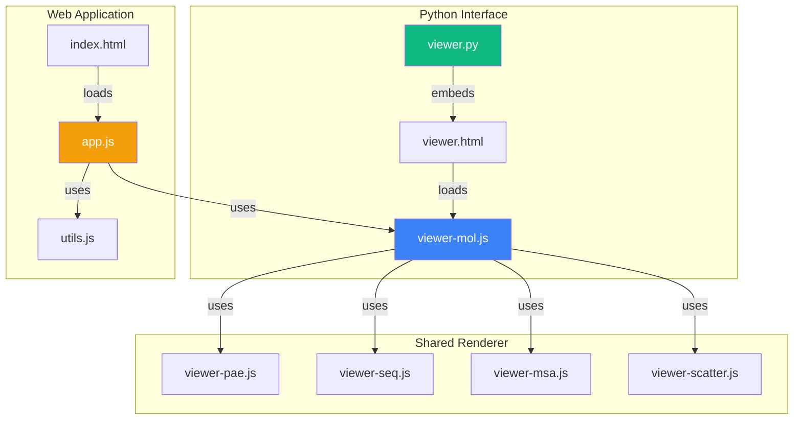
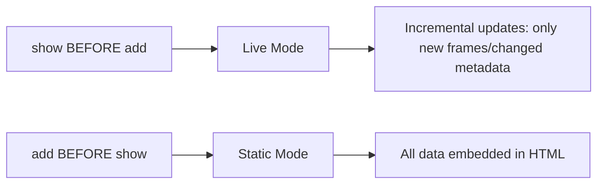
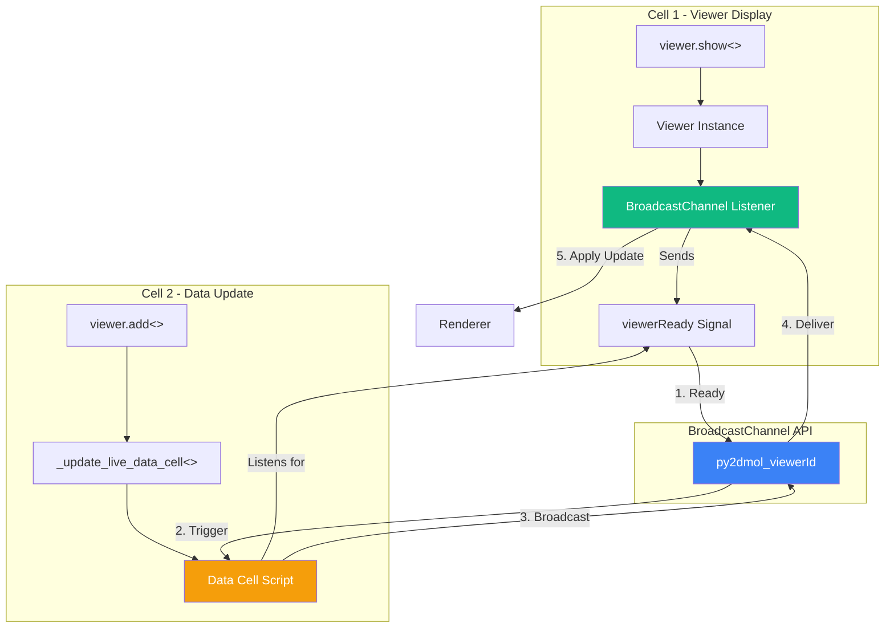

# py2Dmol Technical Reference (AI-Optimized)

**Purpose**: Complete technical documentation for AI systems and developers working with py2Dmol codebase.

**Last Updated**: 2025-12-12

---

## Quick Navigation

- [Architecture Overview](#architecture-overview)
- [File Structure](#file-structure)
- [Python Interface](#python-interface)
- [Grid Layout System](#grid-layout-system)
- [JavaScript Interface](#javascript-interface)
- [Data Flow](#data-flow)
  - [Cross-Cell Communication (BroadcastChannel)](#cross-cell-communication-broadcastchannel)
- [Rendering System](#rendering-system)
- [Scatter Plot Visualization](#scatter-plot-visualization)
- [Function Reference](#function-reference)

---

## Architecture Overview

### System Components

py2Dmol has **two independent interfaces** that share the same renderer:

1. **Python Package** (`py2Dmol/`) - Jupyter/Colab widget
2. **Web Application** (`web/` + `index.html`) - Standalone browser app



### Technology Stack

| Layer | Technology | Purpose |
|-------|-----------|---------|
| **Python** | numpy, gemmi, IPython | Data processing, PDB/CIF parsing, Jupyter integration |
| **Rendering** | HTML5 Canvas (2D) | Pseudo-3D visualization (NOT WebGL) |
| **Alignment** | numeric.js (SVD) | Kabsch algorithm, PCA-based best view |
| **File Parsing** | gemmi (Python), custom JS parsers | PDB/CIF/MSA parsing |
| **UI Framework** | Vanilla JS + TailwindCSS | No heavy frameworks |

### Key Design Decisions

1. **Canvas-Based Rendering**: Uses 2D canvas with pseudo-3D projection (NOT WebGL)
2. **Two-Mode System**: Static (all data at once) vs Live (incremental updates)
3. **Per-Object State**: Each object has independent rotation, color, visibility
4. **Message Passing**: Python → JavaScript via `display(Javascript(...))`
5. **No Server**: All processing happens client-side (browser or notebook)

---

## File Structure

```
py2Dmol/
├── py2Dmol/                     # Python Package
│   ├── viewer.py                # Main Python interface (2,424 lines)
│   ├── grid.py                  # Grid layout system (271 lines)
│   └── resources/
│       ├── viewer.html          # Jupyter widget template (200 lines)
│       ├── viewer-mol.js        # CORE: Pseudo3DRenderer (7,447 lines)
│       ├── viewer-pae.js        # PAE matrix visualization (906 lines)
│       ├── viewer-seq.js        # Sequence viewer (2,257 lines)
│       ├── viewer-msa.js        # MSA viewer (4,713 lines)
│       └── viewer-scatter.js    # Scatter plot visualization (588 lines)
│
├── web/                         # Web Application
│   ├── app.js                   # Web app logic (6,451 lines)
│   ├── utils.js                 # Utilities: parsing, alignment (2,797 lines)
│   └── style.css                # Global styles
│
├── index.html                   # Main web app entry (463 lines)
├── msa.html                     # Standalone MSA viewer (231 lines)
└── README.md                    # User documentation
```

### File Headers (AI Context)

Every major file has an AI-friendly header:

```javascript
// ============================================================================
// py2Dmol/resources/viewer-mol.js
// -------------------------------
// AI Context: CORE RENDERER (Pseudo3DRenderer)
// - This is the heart of the visualization.
// - Implements `Pseudo3DRenderer` class.
// - Handles 3D projection, Z-sorting, and canvas drawing.
// ============================================================================
```

---

## Python Interface

### Entry Point: `viewer.py`

**Path**: `py2Dmol/viewer.py`
**Class**: `view`
**Lines**: 2,424

#### Core Responsibilities

1. Manages list of objects and frames
2. Serializes data to JSON for frontend
3. Generates HTML/JS for Jupyter embedding
4. Implements live mode communication bridge

#### Constructor: `view.__init__()`

```python
def __init__(self,
    size=(400,400),           # Canvas size (width, height)
    controls=True,            # Show control UI
    box=True,                 # Show bounding box
    color="auto",             # Color mode
    colorblind=False,         # Colorblind-safe palette
    pastel=0.25,              # Pastel saturation (0.0-1.0)
    shadow=True,              # Enable/disable shadows
    shadow_strength=0.5,      # Shadow strength (0.0-1.0)
    outline="full",           # Outline mode: "full", "partial", "none"
    width=3.0,                # Line width (2.0-4.7)
    ortho=1.0,                # Ortho projection (0=perspective, 1=ortho)
    rotate=False,             # Auto-rotate
    autoplay=False,           # Auto-play animation
    pae=False,                # Show PAE matrix
    pae_size=300,             # PAE canvas size
    scatter=None,             # Scatter plot: False/True/dict with xlabel, ylabel, xlim, ylim
    scatter_size=300,         # Scatter canvas size
    overlay=False,            # Overlay all frames
    detect_cyclic=True,       # Auto-detect cyclic molecules
    id=None                   # Explicit viewer ID (auto-generated if None)
):
```


#### Key State Variables

```python
self.objects = []                    # List of object dictionaries
self._current_object_data = None     # Current object's frame list
self._is_live = False               # Live mode flag
self.config = {}                     # Viewer configuration

# Alignment state (per-object)
self._coords = None
self._plddts = None
self._chains = None
self._position_types = None
self._pae = None
self._scatter = None
self._position_names = None
self._position_residue_numbers = None
```

**Important**: NO `self.rotation_matrix` - rotation is managed client-side per-object.

#### Primary Functions

##### `add(coords, plddts, chains, ...)`

Adds a frame to the current object.

```python
def add(self,
    coords,                   # Nx3 numpy array
    plddts=None,              # N-length pLDDT scores
    chains=None,              # N-length chain IDs
    position_types=None,      # N-length types: P/D/R/L
    pae=None,                 # LxL PAE matrix
    scatter=None,             # Scatter plot point: [x, y], (x, y), or {"x": x, "y": y}
    name=None,                # Object name (auto-creates new obj if different)
    align=True,               # Auto-align to first frame
    position_names=None,      # Residue names
    residue_numbers=None,     # PDB resSeq
    atom_types=None,          # Deprecated: use position_types
    contacts=None,            # Contact restraints
    bonds=None,               # Explicit bonds
    color=None,               # Color override
    scatter_config=None       # Per-object scatter settings: {"xlabel", "ylabel", "xlim", "ylim"}
):
```

**No `new_obj` parameter** - objects are created automatically when `name` changes.

##### `add_pdb(filepath, chains, name, ...)`

Loads structure from PDB/CIF file.

```python
def add_pdb(self,
    filepath,                 # Path to .pdb or .cif
    chains=None,              # Chain IDs to load
    name=None,                # Object name (auto-creates if different)
    paes=None,                # PAE matrices (one per model)
    align=True,               # Auto-align
    use_biounit=False,        # Load biological assembly
    biounit_name="1",         # Assembly name
    load_ligands=True,        # Load ligands
    contacts=None,            # Contact restraints
    scatter=None,             # Scatter plot data (CSV filepath or array)
    color=None,               # Color override
    scatter_config=None       # Per-object scatter settings
):
```

**No `new_obj` parameter**.

##### `from_pdb(pdb_id, ...)`

Convenience function: downloads from RCSB if 4-char code.

```python
def from_pdb(self,
    pdb_id,                   # 4-char code or filepath
    chains=None,
    name=None,                # Auto-generated if None
    align=True,               # Default: True (not False)
    use_biounit=False,
    biounit_name="1",
    load_ligands=True,
    contacts=None,
    scatter=None,             # Scatter plot data (CSV filepath or array)
    color=None,
    ignore_ligands=None,      # Deprecated parameter (backward compat)
    show=None,                # Auto-display viewer (default: True for first call)
    scatter_config=None       # Per-object scatter settings
):
```

**Default `align=True`** (not `False`).

##### `from_afdb(uniprot_id, ...)`

Loads from AlphaFold DB (downloads from EBI).

```python
def from_afdb(self,
    uniprot_id,               # UniProt ID (e.g., "Q5VSL9")
    chains=None,
    name=None,
    align=True,
    use_biounit=False,
    biounit_name="1",
    load_ligands=True,
    scatter=None,             # Scatter plot data
    color=None,
    show=None                 # Auto-display viewer
):
```

##### `show()`

Displays the viewer.

- Called **before** `add()`: Creates empty live viewer
- Called **after** `add()`: Creates static viewer with all data

##### `save_state(filepath)` / `load_state(filepath)`

Save/restore complete viewer state to JSON.

#### Static vs Live Mode



**Static Mode**: `add()` → `show()`
- All data embedded in `window.py2dmol_staticData[viewer_id]`
- Single HTML output

**Live Mode**: `show()` → `add()`
- **Incremental updates** sent via `display(Javascript(...))`
- Only sends NEW frames not yet transmitted (tracked in `_sent_frame_count`)
- Only sends CHANGED metadata (tracked in `_sent_metadata`)
- Ephemeral JavaScript scripts that get garbage collected
- Updates processed by `handleIncrementalStateUpdate()` in viewer-mol.js

---

## Grid Layout System

### Overview

The Grid system allows displaying multiple py2Dmol viewers in a responsive grid layout. Introduced to support gallery-style visualizations in Jupyter notebooks.

**Path**: `py2Dmol/grid.py`
**Class**: `Grid`
**Lines**: 271

### Three Usage Patterns

#### 1. Context Manager (Recommended)

```python
with py2Dmol.grid(cols=2) as g:
    g.view().from_pdb('1YNE')
    g.view(rotate=True).from_pdb('1BJP')
# Grid displays automatically on exit
```

**Behavior**: `__exit__()` automatically calls `show()`

#### 2. Explicit Builder

```python
grid = py2Dmol.Grid(cols=2, size=(300, 300))
grid.view().from_pdb('1YNE')
grid.view(rotate=True).from_pdb('1BJP')
grid.show()  # Manual display
```

**Use case**: When you need control over display timing

#### 3. Function-Based

```python
v1 = py2Dmol.view()
v1.from_pdb('1YNE', show=False)

v2 = py2Dmol.view(rotate=True)
v2.from_pdb('1BJP', show=False)

py2Dmol.show_grid([v1, v2], cols=2)
```

**Use case**: Displaying pre-created viewers. **Important**: Must pass `show=False` to prevent auto-showing.

### Grid Configuration

#### Constructor: `Grid.__init__()`

```python
def __init__(self,
    cols=2,                # Number of columns
    rows=None,             # Number of rows (auto-calculated if None)
    gap=5,                 # Gap between viewers in pixels
    size=None,             # Default size for each viewer (width, height)
    controls=False,        # Default controls setting
    box=False              # Default box setting
):
```

**Key behaviors**:
- `rows` auto-calculated as `ceil(num_viewers / cols)` if None
- `size` defaults to `(400, 400)` if not specified
- `controls=False` and `box=False` create clean gallery layouts

### Grid.view() Method

**Critical feature** (grid.py:69-113): Creates viewers with grid-specific behavior.

**Key behaviors**:
1. Applies grid defaults (size, controls, box) if not explicitly specified in kwargs
2. Sets `viewer._is_live = True` to prevent auto-showing
3. Appends viewer to grid's viewer list

**Why `_is_live = True`?** Without this flag, calling `g.view().from_pdb('1YNE')` would immediately display the viewer individually before the grid collects it. This flag tells the viewer it's managed externally.

### Display Flow

**Key steps** (grid.py:131-206):
1. Calculate rows if not specified
2. Generate HTML for each viewer using `viewer._display_viewer(static_data, include_libs=...)`
3. Only first viewer includes library scripts (`include_libs=True`), subsequent viewers reuse them (`include_libs=False`)
4. Build grid container with CSS overrides
5. Display using `IPython.display.HTML()`

**Library Loading Optimization**: Instead of regex stripping, the grid passes `include_libs=False` to subsequent viewers, preventing duplicate ~95KB script injection entirely.

### CSS Override System

Individual viewers have built-in spacing (mainContainer padding: 8px + gap: 15px, viewerWrapper gap: 8px) appropriate for standalone use but problematic in grids.

Grid injects CSS selectors with higher specificity (grid.py:184-192):
- `.py2dmol-grid-item #mainContainer` sets padding: 0, gap: 0, margin: 0
- `.py2dmol-grid-item #viewerWrapper` sets gap: 0, margin: 0

**CSS Specificity**: Class + ID `(0,1,1)` beats ID alone `(0,1,0)`, so grid CSS should override template styles.

### Sizing System

**Flow**: Grid size → viewer config → JavaScript reads config → sets canvas/container sizes

Grid defaults (e.g., size=(200,200)) are applied to viewers, serialized in config, and JavaScript (viewer-mol.js:6764-6765) applies them to DOM elements. Previous approach using inline style injection was removed to avoid forced sizing.

### Debugging

**CSS Override Issues**: If grid spacing appears inconsistent, use browser DevTools to inspect computed styles on `#mainContainer` and `#viewerWrapper`. Check if grid CSS overrides (padding: 0, gap: 0) are being applied or crossed out due to specificity conflicts.

**Empty Grid**: "Warning: No viewers to display in grid" means `show()` was called before any viewers were added. Ensure at least one viewer is added via `grid.view()` or `grid.add_viewer()`.

### Performance Considerations

#### Memory

- Each viewer maintains independent state (rotation, zoom, center)
- JavaScript libraries loaded once (inline ~95KB), shared across all viewers
- Static data embedded in HTML (no server requests)
- Grid optimization: Only first viewer includes library scripts

#### Rendering

- Each viewer renders independently on its own canvas
- No shared WebGL context (uses 2D Canvas API)
- Grid layout handled by CSS Grid (browser-optimized)

#### Typical limits

| Grid Size | Performance | Notes |
|-----------|-------------|-------|
| 2×2 (4 viewers) | ✅ Excellent | Recommended for most use cases |
| 3×3 (9 viewers) | ✅ Good | Smooth on modern hardware |
| 4×4 (16 viewers) | ⚠️ Moderate | May slow down on older machines |
| 5×5+ (25+ viewers) | ❌ Slow | Consider pagination or lazy loading |

### Example Use Cases

#### Protein Gallery

```python
with py2Dmol.grid(cols=4, gap=5, size=(200, 200)) as g:
    for pdb_id in ['1YNE', '1BJP', '9D2J', '2BEG']:
        g.view().from_pdb(pdb_id)
```

**Result**: Clean 4-column gallery with no controls/boxes.

#### Comparison View

```python
grid = py2Dmol.Grid(cols=2, size=(400, 400), controls=True, box=True)
grid.view().from_pdb('1YNE')
grid.view(color='chain').from_pdb('1BJP')
grid.show()
```

**Result**: Side-by-side comparison with full controls.

#### Mixed Configuration

```python
with py2Dmol.grid(cols=3) as g:
    g.view().from_pdb('1YNE')                    # No controls (grid default)
    g.view(controls=True).from_pdb('1BJP')       # Override: with controls
    g.view().from_pdb('9D2J')                    # No controls (grid default)
```

**Result**: Middle viewer has controls, others don't.

---

## JavaScript Interface

### Core Renderer: `viewer-mol.js`

**Path**: `py2Dmol/resources/viewer-mol.js`
**Class**: `Pseudo3DRenderer`
**Lines**: 7,447

#### Global Registry

```javascript
window.py2dmol_viewers = {};          // All viewer instances by ID
window.py2dmol_staticData = {};       // Static data keyed by viewer_id
window.viewerConfig = {};             // Current config
window.viewerApi = null;              // Reference to main renderer API
```

#### Pseudo3DRenderer Class

**Class Methods**:
- `constructor(canvas)` - Initialize renderer (reads config from `window.viewerConfig`)
- `addObject(name)` - Create empty object
- `addFrame(data, objectName)` - Add frame to object
- `setFrame(frameIndex, skipRender)` - Switch frame
- `render(reason)` - Main render loop

**Public API** (exposed via `window.py2dmol_viewers[viewer_id]`):

The viewer exposes a minimal API:
- `handleIncrementalStateUpdate(newFramesByObject, changedMetadataByObject)` - Process incremental updates from Python
- `renderer` - Reference to the Pseudo3DRenderer instance

**Note**: Legacy `handlePython*` methods (handlePythonUpdate, handlePythonNewObject, etc.) have been removed and replaced with the unified `handleIncrementalStateUpdate` method.

**Per-Object State** (stored in `this.objectsData[name].viewerState`):
```javascript
{
    rotation: [[1, 0, 0], [0, 1, 0], [0, 0, 1]],  // 3x3 rotation matrix
    zoom: 1.0,                                     // Zoom level
    perspectiveEnabled: false,                     // Enable/disable perspective projection
    focalLength: 200.0,                            // Focal length for perspective
    center: null,                                  // Rotation center (computed)
    extent: null,                                  // Object extent (computed)
    currentFrame: -1                               // Active frame index (-1 = none)
}
```

#### Rendering Pipeline

The `render()` method follows this flow:
1. Apply rotation matrix to coordinates
2. Project 3D → 2D screen space (ortho/perspective blend)
3. Build segments from bonds/contacts with depth
4. Depth sort (painter's algorithm)
5. Grid-based culling (for large molecules)
6. Draw in two passes: outline then main
7. Apply shadows (grid-based shadow map)

### Web App: `app.js`

**Path**: `web/app.js`
**Lines**: 6,451

#### Initialization Flow

```javascript
DOMContentLoaded → initializeApp() → {
    1. initializeViewerConfig()       // Create window.viewerConfig
    2. setupCanvasDimensions()        // Set canvas 600x600
    3. initializePy2DmolViewer()      // Create Pseudo3DRenderer
    4. Get viewerApi reference        // window.py2dmol_viewers[id]
    5. Setup MSA callbacks            // If MSAViewer exists
    6. setupEventListeners()          // Wire 60+ UI handlers
    7. initDragAndDrop()              // File drag/drop
    8. setStatus("Ready...")          // Display message
}
```

#### Key Functions

- `handleFetch()` - Fetch from PDB/AlphaFold
- `handleFileUpload(event)` - Process file uploads
- `handleObjectChange()` - Switch active object
- `setupEventListeners()` - Wire all UI events

### Utilities: `utils.js`

**Path**: `web/utils.js`  
**Lines**: 2,797

#### Key Functions

##### Alignment

```javascript
function calculateMean(coords)
// Returns: [mean_x, mean_y, mean_z]

function kabsch(A, B)
// A, B: Nx3 centered arrays
// Returns: 3x3 rotation matrix
// Uses: numeric.svd() for SVD decomposition

function align_a_to_b(fullCoordsA, alignCoordsA, alignCoordsB)
// Aligns A to B using subset of coordinates
```

##### Best View

```javascript
function bestViewTargetRotation_relaxed_AUTO(coords, currentRotation, canvasWidth, canvasHeight)
// Uses PCA (SVD on covariance) to find optimal rotation
// Maps largest variance to longest canvas dimension
```

##### Parsing

```javascript
function parsePDB(text)
// Returns: { models, modresMap, conectMap }
// Parses: ATOM, HETATM, CONECT, MODRES records

function parseCIF(text)
// Returns: Array of models
// Parses: _atom_site, _struct_conn, _chem_comp_bond
```

---

## Data Flow

### Static Mode

```
Python                           JavaScript
──────────────────────────────────────────────
viewer.add() ────────┐
viewer.add() ────────┼─→ [Objects with frames]
viewer.show() ───────┘
    │
    ├─→ Serialize to JSON
    ├─→ Embed in HTML as:
    │   window.py2dmol_staticData[viewer_id] = {...}
    └─→ Browser loads complete HTML
            │
            ├─→ Parse py2dmol_staticData
            └─→ initializePy2DmolViewer()
                    │
                    └─→ Render all frames
```

### Live Mode (Incremental Updates)

```
Python                           JavaScript
──────────────────────────────────────────────
viewer.show() ────→ Empty viewer initialized
    │                       │
    │                       └─→ window.py2dmol_viewers[id]
    │
viewer.add() ─────→ _send_incremental_update()
    │                       │
    ├─→ Detect new frames (via _sent_frame_count)
    ├─→ Detect changed metadata (via _sent_metadata)
    ├─→ Serialize ONLY new/changed data
    ├─→ Create ephemeral JS:
    │   "window.py2dmol_viewers[id]
    │    .handleIncrementalStateUpdate(
    │       newFramesByObject,
    │       changedMetadataByObject
    │    )"
    │                       │
    └─→ display(Javascript(...))
                            │
                            ├─→ Create missing objects
                            ├─→ Append new frames
                            ├─→ Apply changed metadata
                            └─→ Re-render
```

**Key Features:**
- **Memory efficient**: Only transmits deltas, not full state
- **Auto garbage collection**: Ephemeral scripts disappear after execution
- **Tracked state**: `_sent_frame_count` and `_sent_metadata` dictionaries
- **Cross-iframe compatible**: Works via BroadcastChannel in Google Colab

### Cross-Cell Communication (BroadcastChannel)

**Purpose**: Enable viewers in different notebook cells to stay synchronized, especially in Google Colab where each cell output runs in a separate iframe.

**Architecture**:



**Flow (Incremental Updates)**:

1. **Cell 1**: User calls `viewer.show()` → Creates viewer with BroadcastChannel listener
2. **Viewer**: Sends `viewerReady` signal on BroadcastChannel (if needed for synchronization)
3. **Cell 2**: User calls `viewer.from_pdb("1UBQ")` → Triggers `_send_incremental_update()`
4. **Python**: Calculates NEW frames and CHANGED metadata, broadcasts via BroadcastChannel
5. **Viewer** (Cell 1): Receives incremental update, applies deltas, re-renders

**Incremental Design**: Only transmits changes (new frames/metadata) instead of full state. Uses `_sent_frame_count` and `_sent_metadata` to track what has been sent. Ephemeral scripts get garbage collected after execution.

**Key Components**:

#### Python: `_send_incremental_update()` (viewer.py:445)

Sends only NEW frames and CHANGED metadata to minimize data transfer:
- Tracks sent frames via `_sent_frame_count` dict
- Tracks sent metadata via `_sent_metadata` dict
- Broadcasts via BroadcastChannel for cross-iframe support
- Falls back to direct window call for same-window scenarios
- Creates ephemeral scripts that auto garbage collect

#### JavaScript: `handleIncrementalStateUpdate()` (viewer-mol.js:7326)

Processes incremental updates from Python:
1. Creates missing objects
2. Appends new frames to objects
3. Applies changed metadata (color, contacts, bonds, rotation, center)
4. Re-renders

**BroadcastChannel Integration**:
- Listens for `incrementalStateUpdate` operations
- Skips own broadcasts via `sourceInstanceId` check
- Message format: `{operation, args: [newFramesByObject, changedMetadataByObject], sourceInstanceId}`

**Compatibility**:

| Environment | Mechanism | Status |
|-------------|-----------|--------|
| **Google Colab** | BroadcastChannel cross-iframe | ✅ Works |
| **JupyterLab** | BroadcastChannel same-window | ✅ Works |
| **VSCode Notebooks** | BroadcastChannel same-window | ✅ Works |
| **Older Browsers** | Fallback to ready event listener | ✅ Graceful degradation |

**Benefits**:

1. **Cross-iframe support** - Works in Google Colab where cells are isolated
2. **Same-window optimization** - Also works in JupyterLab/VSCode
3. **Incremental efficiency** - Only transmits new/changed data, not full state
4. **No polling** - Event-driven, efficient
5. **Automatic cleanup** - Ephemeral scripts get garbage collected
6. **Memory efficient** - Tracks sent state to avoid retransmission

### Message Protocol (Live Mode)

**Current Protocol**: Incremental State Updates (as of 2025-12-11)

All live mode updates use the `incrementalStateUpdate` operation via BroadcastChannel.

#### `incrementalStateUpdate`

**Sent by**: `_send_incremental_update()` (called by `add()`, `set_color()`, etc.)

**Message Structure**:
```javascript
{
    operation: 'incrementalStateUpdate',
    args: [newFramesByObject, changedMetadataByObject],
    sourceInstanceId: 'py_xxx'
}
```

**Arguments**:

1. **newFramesByObject**: Object name → Array of NEW frames
```javascript
{
    "protein1": [
        {
            coords: [[x, y, z], ...],
            plddts: [50, 60, ...],
            chains: ["A", "B", ...],
            position_types: ["P", "P", ...],
            pae: [uint8, ...] or null,
            position_names: ["ALA", ...],
            residue_numbers: [1, 2, ...],
            bonds: [[0, 1], [1, 2]],
            contacts: [[10, 50, 1.0, {r, g, b}], ...]
        }
    ]
}
```

2. **changedMetadataByObject**: Object name → CHANGED metadata fields only
```javascript
{
    "protein1": {
        color: {type: "mode", value: "plddt"},
        contacts: [[10, 50, 1.0, {r, g, b}], ...],
        bonds: [[0, 1], [1, 2]],
        rotation_matrix: [[...], [...], [...]],
        center: [x, y, z]
    }
}
```

**Legacy Message Types** (deprecated as of 2025-12-11):
- `py2DmolUpdate`, `py2DmolNewObject`, `py2DmolSetObjectColor`, `py2DmolSetColor`, `py2DmolSetViewTransform`, `py2DmolClearAll` are no longer used
- `_send_message()` is now a legacy wrapper that calls `_send_incremental_update()`

---

## Rendering System

### Coordinate System

**3D Space** (right-handed):
- X: right
- Y: up  
- Z: toward viewer

**Projection**:
```javascript
// Apply rotation
rotated = coords @ rotationMatrix

// Apply orthographic/perspective projection
scale = ortho + (1 - ortho) * perspectiveFactor
projected_x = rotated.x * scale + centerX
projected_y = -rotated.y * scale + centerY  // Flip Y for canvas
depth = rotated.z
```

### Z-Sorting

Segments sorted by **average Z** after rotation (painter's algorithm).

### Shadow System

1. **Grid-based shadow map** (2D grid cells)
2. Store highest Z per cell
3. Segments below grid max are darkened
4. **Shadow isolation**: Frames don't cast shadows on each other in overlay mode

### Outline Rendering

- **none**: No outline
- **partial**: Outline with butt caps
- **full**: Outline with rounded caps

Drawn in two passes:
1. Outline layer (thicker, darker)
2. Main layer (thinner, colored)

### Color System

**5-Level Hierarchy** (high → low priority):

1. **Position**: Per-atom override
2. **Chain**: Per-chain override
3. **Frame**: Defined in `add(..., color=...)`
4. **Object**: Defined via `set_color(...)`
5. **Global**: Default in `view(color=...)`

**Color Modes**:
- `auto` - Chain if multi-chain, else rainbow
- `chain` - Color by chain
- `plddt` - AlphaFold confidence (B-factor)
- `rainbow` - N→C terminus gradient
- `entropy` - MSA entropy (if available)
- `deepmind` - DeepMind pLDDT coloring

**Color Resolution**:
```javascript
function resolveColor(position, chain, frame, object, global) {
    return positionColors[position] 
        || chainColors[chain]
        || frameColor
        || objectColor
        || globalColor;
}
```

---

## Scatter Plot Visualization

### Overview

The scatter plot feature allows displaying 2D scatter plots synchronized with frame animation. Each frame can have an associated scatter point (e.g., RMSD vs Energy, PC1 vs PC2) that is highlighted during playback.

**Path**: `py2Dmol/resources/viewer-scatter.js`
**Class**: `ScatterPlotViewer`
**Lines**: 588

**Shared Component**: `viewer-scatter.js` is used by both Python interface (Jupyter/Colab) and web interface (browser app), just like the core renderer and other visualization components (PAE, MSA, sequence).

### Architecture

**Data Model**: Per-frame data with per-object configuration
- **Scatter data**: Each frame can have `scatter=[x, y]` representing one point (per-frame)
- **Scatter config**: Each object has its own labels and limits (per-object)
- Scatter plot accumulates all frame points for visualization
- Frame index directly maps to scatter point index

**Configuration Hierarchy**:
- **Global** (`window.viewerConfig.scatter`): Only `enabled` (boolean) and `size` (canvas size in pixels)
- **Per-Object** (`object.scatterConfig`): `xlabel`, `ylabel`, `xlim`, `ylim` (each object has its own)
  - Python sends `scatter_config` (snake_case) in JSON
  - JavaScript stores as `scatterConfig` (camelCase) internally
- **No fallback to global** for labels - purely object-specific or defaults ("X", "Y")

**Integration Pattern**: Follows PAE integration approach with adaptations:
- **Shared component**: Same `viewer-scatter.js` used by both Python and web interfaces
- Configuration split: global (canvas size) + per-object (labels/limits)
- Conditional script loading (only when scatter enabled)
- HTML container similar to PAE
- JavaScript initialization collects all frame data
- Frame synchronization via `py2dmol-frame-change` event
- Object switching updates scatter labels/limits automatically

### Python API

#### Global Configuration

**Enable scatter globally**:
```python
v = viewer.view(scatter=True)              # Enable with default 300x300 canvas
v = viewer.view(scatter=True, scatter_size=400)  # Custom canvas size

# Set global defaults for all objects (can be overridden per-object)
v = viewer.view(scatter={
    "enabled": True,
    "size": 400,
    "xlabel": "X",
    "ylabel": "Y",
    "xlim": [0, 10],
    "ylim": [0, 10]
})
```

**Note**: Global scatter config sets defaults for all objects. Per-object `scatter_config` parameter overrides these defaults.

#### Per-Object Configuration (Labels and Limits)

**Basic usage** (per-object labels):
```python
v = viewer.view(scatter=True)

# Object 1: RMSD vs Energy
v.add(coords, scatter=[1.5, -120.5],
      scatter_config={"xlabel": "RMSD (Å)", "ylabel": "Energy (kcal/mol)"})

# Object 2: PC1 vs PC2
v.new_obj("pca")
v.add(coords, scatter=[-0.5, 0.3],
      scatter_config={"xlabel": "PC1", "ylabel": "PC2"})

v.show()
# Switching objects updates scatter plot labels automatically
```

**With limits** (object-specific limits):
```python
v = viewer.view(scatter=True)

v.add(coords, scatter=[1.5, -120.5],
      scatter_config={
          "xlabel": "RMSD (Å)",
          "ylabel": "Energy (kcal/mol)",
          "xlim": [0, 10],       # Optional: [min, max]
          "ylim": [-150, -90]    # Optional: [min, max]
      })

# Add more frames - they inherit scatter_config from first frame
for rmsd, energy, coords in zip(rmsd_vals, energy_vals, trajectory):
    v.add(coords, scatter=[rmsd, energy])

v.show()
```

**Without explicit labels** (uses defaults):
```python
v = viewer.view(scatter=True)
v.add(coords, scatter=[1.5, -120.5])  # No scatter_config
v.show()
# Labels default to "X" and "Y"
```

#### Per-Frame Data

**Supported formats**:
```python
# List (preferred)
v.add(coords, scatter=[1.5, -120.5])

# Tuple
v.add(coords, scatter=(1.5, -120.5))

# Dictionary
v.add(coords, scatter={"x": 1.5, "y": -120.5})

# None (no scatter for this frame)
v.add(coords, scatter=None)
```

**Validation**:
- Format checked: must be [x, y], (x, y), or {"x": x, "y": y}
- Values validated: must be numeric (float convertible)
- Normalized to [x, y] list format internally

#### Frame Inheritance

Frames inherit scatter from previous frame if omitted:
```python
v = viewer.view(scatter=True)
v.add(coords1, scatter=[1.0, -120])  # Frame 0: explicit
v.add(coords2)                       # Frame 1: inherits [1.0, -120]
v.add(coords3, scatter=[2.0, -115])  # Frame 2: explicit
# Scatter points: [1.0,-120], [1.0,-120], [2.0,-115]
```

This follows the same pattern as `plddts`, `chains`, and `position_types`.

#### CSV Label Extraction (Automatic)

When loading scatter data from CSV files in `add_pdb()`, labels are automatically extracted from headers and stored in object-specific config:

```python
v = viewer.view(scatter=True)
v.add_pdb("protein.pdb", scatter="rmsd.csv")  # CSV headers: "Frame,RMSD"
# scatter_config automatically created: {"xlabel": "Frame", "ylabel": "RMSD"}
v.show()
# Scatter plot displays with extracted labels
```

#### Object Structure

Scatter config is stored in the object dict alongside contacts, bonds, and color:

```python
{
    "name": "protein1",
    "frames": [...],
    "contacts": None,
    "bonds": None,
    "color": None,
    "scatter_config": {          # NEW: per-object scatter configuration
        "xlabel": "RMSD (Å)",
        "ylabel": "Energy (kcal/mol)",
        "xlim": [0, 10],
        "ylim": [-150, -90]
    }
}
```

**Serialization**: `scatter_config` is included in JSON output when saving state or embedding in HTML.

### JavaScript Implementation

#### ScatterPlotViewer Class

**Constructor**:
```javascript
new ScatterPlotViewer(canvas, mainRenderer)
```
- `canvas`: Canvas element for scatter plot
- `mainRenderer`: Reference to Pseudo3DRenderer for frame synchronization

**Key Methods**:

| Method | Purpose | Parameters |
|--------|---------|------------|
| `setData(xData, yData, xlabel, ylabel)` | Set complete scatter data | Arrays of x/y values, axis labels |
| `addPoint(x, y)` | Add single point (live mode) | X and Y coordinates |
| `render()` | Render scatter plot | None |
| `findNearestPoint(mouseX, mouseY)` | Find point near cursor | Mouse coordinates |
| `dataToCanvas(x, y)` | Convert data to screen coordinates | Data coordinates |

#### Config Initialization

On static data load, each object's `scatterConfig` is initialized from Python's `scatter_config` (snake_case → camelCase conversion). Defaults: `{xlabel: 'X', ylabel: 'Y', xlim: null, ylim: null}`.

#### Config Usage (Object Switching)

When switching objects, `updateScatterData()` reads `object.scatterConfig` and updates the scatter renderer with object-specific labels/limits.

#### Dynamic Frame Addition

In live mode, `addFrame()` automatically calls `scatterRenderer.addPoint(x, y)` when frame includes scatter data.

### Rendering Features

#### Visual Design

**Point Colors**:
- **Past frames**: Normal blue (`#3b82f6`)
- **Future frames**: Light blue/faded (`#bfdbfe`)
- **Current frame**: Gold/yellow with outline (`#fbbf24` fill, `#f59e0b` stroke)
- **Hovered point**: Light blue highlight (`#60a5fa`)

**Drawing Order**: Reverse order (later frames drawn under earlier frames)

**Point Size**: 4px radius (scaled by DPI)

#### Interactive Features

**Hover**: Highlights nearest point within 15px threshold
- Cursor changes to pointer
- Point color changes to hover color

**Click**: Jumps to corresponding frame
- Calls `mainRenderer.setFrame(index)`
- Updates 3D viewer to clicked frame

**Frame Synchronization**:
- Listens to `py2dmol-frame-change` custom event
- Automatically highlights current frame point
- Works during animation playback

#### Axis System

**Auto-Scaling**:
- Calculates min/max from data
- Adds 5% padding on each side
- Handles edge cases (single point, zero range)

**Manual Limits**:
- `xlim` and `ylim` override auto-calculation
- Applied after `setData()` call
- Format: `[min, max]`

**Tick Generation**:
- Nice round numbers (1, 2, 5, 10 multiples)
- Target ~5 ticks per axis
- Smart formatting (K/M notation for large numbers)

**Labels**:
- X-axis label centered below plot
- Y-axis label rotated 90° on left side
- Font: 12px sans-serif (scaled by DPI)

### Data Flow

```
Python: view(scatter={...}) + add(coords, scatter=[x, y], scatter_config={...})
    ↓
Validate and store: self._scatter (per-frame), object["scatter_config"] (per-object)
    ↓
Serialize to JSON: frame["scatter"], object["scatter_config"]
    ↓
JavaScript: Load static data → store as scatterConfig (camelCase)
    ↓
Collect all frame points → ScatterPlotViewer.setData(xData, yData, xlabel, ylabel)
    ↓
Render scatter plot + sync with frame changes
```

### Performance Optimizations

#### Memory

**Diff Optimization**: Only serialize scatter when it changes between frames
```python
# In _display_viewer() (viewer.py:653-656)
curr_scatter = frame.get("scatter")
if frame_idx == 0 or curr_scatter != prev_scatter:
    if curr_scatter is not None:
        light_frame["scatter"] = curr_scatter
    prev_scatter = curr_scatter
```

**Frame Inheritance**: Reduces redundancy for slowly-changing metrics

**Minification**: Terser compression to 6.4KB

#### Rendering

**Canvas-Based**: Hardware-accelerated 2D canvas rendering

**DPI-Aware**: Scales canvas for high-resolution displays

**Single Render**: Only re-renders on data change or frame change

### Use Cases

#### RMSD vs Energy Trajectory
```python
v = viewer.view(
    scatter={
        "xlabel": "RMSD from Native (Å)",
        "ylabel": "Potential Energy (kcal/mol)",
        "xlim": [0, 8],
        "ylim": [-500, -200]
    }
)

for frame in md_trajectory:
    rmsd = calculate_rmsd(frame, native)
    energy = calculate_energy(frame)
    v.add(frame.coords, scatter=[rmsd, energy])
```

#### PCA Visualization
```python
pca_coords = pca.transform(trajectory_data)  # Nx2 array

v = viewer.view(
    scatter={
        "xlabel": "Principal Component 1",
        "ylabel": "Principal Component 2"
    }
)

for i, coords in enumerate(trajectory):
    v.add(coords, scatter=[pca_coords[i, 0], pca_coords[i, 1]])
```

#### Conformational Space Exploration
```python
v = viewer.view(scatter=True)

for angle1, angle2, coords in zip(phi_angles, psi_angles, structures):
    v.add(coords, scatter=[angle1, angle2])
# Creates Ramachandran-like plot synchronized with structure
```

### Technical Details

#### Config Normalization

**Python**:
- Global: `scatter` parameter in `view()` accepts `True`, `False`, or dict with `{enabled, size, xlabel, ylabel, xlim, ylim}`
- Per-object: `scatter_config` parameter in `add()` accepts dict with `{xlabel, ylabel, xlim, ylim}`
- Per-object config overrides global defaults

**JavaScript**:
- Receives `scatter_config` (snake_case) from Python, stores as `scatterConfig` (camelCase)
- Defaults: xlabel='X', ylabel='Y', xlim=null, ylim=null

#### Conditional Loading

Scatter script only loaded when enabled:
```python
# In show() method (viewer.py:759)
if self.config["scatter"]["enabled"]:
    with importlib.resources.open_text(py2dmol_resources, 'viewer-scatter.min.js') as f:
        scatter_js_content = f.read()
    container_html = f'<script>{scatter_js_content}</script>\n' + container_html
```

**Benefits**:
- No overhead when scatter not used
- Keeps HTML file size minimal
- On-demand feature loading

### Comparison with PAE

| Aspect | PAE | Scatter |
|--------|-----|---------|
| **Data Level** | Per-object (one matrix) | Per-frame (one point) |
| **Visualization** | Single heatmap | Accumulated scatter plot |
| **Data Structure** | 2D matrix (L×L) | 2D point [x, y] |
| **Initialization** | Load once per object | Collect from all frames |
| **Frame Changes** | Replace entire matrix | Highlight corresponding point |
| **Use Case** | Structural confidence | Trajectory metrics |

---

## Function Reference

### Python: `viewer.py`

| Function | Purpose | Key Parameters |
|----------|---------|----------------|
| `__init__(...)` | Create viewer | `size`, `color`, `shadow`, `overlay` |
| `add(coords, ...)` | Add frame | `coords`, `plddts`, `chains`, `name`, `color` |
| `add_pdb(filepath, ...)` | Load PDB/CIF | `filepath`, `chains`, `name`, `use_biounit` |
| `from_pdb(pdb_id, ...)` | Load from RCSB | `pdb_id`, `chains`, `name`, `align=True` |
| `from_afdb(uniprot_id, ...)` | Load from AlphaFold | `uniprot_id`, `chains` |
| `show()` | Display viewer | Mode depends on when called |
| `new_obj(name, scatter_config)` | Create new object | `name`, `scatter_config` |
| `set_color(color, name)` | Set object color | `color`, `name` |
| `_send_incremental_update()` | Send incremental update to viewer (live mode) | Tracks new frames and changed metadata |
| `save_state(filepath)` | Save to JSON | `filepath` |
| `load_state(filepath)` | Load from JSON | `filepath` |
| `kabsch(a, b)` | Kabsch alignment | Two Nx3 arrays |
| `best_view(coords)` | Optimal rotation | Coords array |
| `align_a_to_b(a, b)` | Align A to B | Two coord arrays |

### JavaScript: `viewer-mol.js`

**Pseudo3DRenderer Class Methods:**

| Method | Purpose | Parameters |
|--------|---------|------------|
| `constructor(canvas)` | Initialize renderer | Canvas element (reads config from window.viewerConfig) |
| `addObject(name)` | Create empty object | Object name |
| `addFrame(data, objectName)` | Add frame to object | Frame data, object name |
| `setFrame(index, skipRender)` | Switch frame | Frame index, skip render flag |
| `render(reason)` | Main render loop | Reason string (for debugging) |

**Exposed API Functions** (via `window.py2dmol_viewers[viewer_id]`):

| Function | Purpose | Parameters |
|----------|---------|------------|
| `handleIncrementalStateUpdate(newFrames, changedMeta)` | Process incremental updates from Python | New frames by object, changed metadata by object |
| `renderer` | Reference to Pseudo3DRenderer instance | N/A |

### JavaScript: `utils.js`

| Function | Purpose | Returns |
|----------|---------|---------|
| `calculateMean(coords)` | Centroid | [x, y, z] |
| `kabsch(A, B)` | Optimal rotation | 3x3 matrix |
| `align_a_to_b(fullA, alignA, alignB)` | Align using subset | Aligned coords |
| `bestViewTargetRotation_relaxed_AUTO(...)` | PCA-based rotation | 3x3 matrix |
| `parsePDB(text)` | Parse PDB | {models, modresMap, conectMap} |
| `parseCIF(text)` | Parse mmCIF | Array of models |

---

## Data Structures

### Object Structure (Python)

```python
{
    "name": "protein1",
    "frames": [
        {
            "coords": [[x, y, z], ...],
            "plddts": [score, ...],
            "chains": ["A", "B", ...],
            "position_types": ["P", "P", ...],
            "pae": [uint8_array] or None,
            "scatter": [x, y] or None,
            "position_names": ["ALA", "GLY", ...],
            "residue_numbers": [1, 2, ...],
            "color": {"type": "mode", "value": "plddt"}
        }
    ],
    "rotation_matrix": [[...], [...], [...]],
    "center": [x, y, z],
    "contacts": [[idx1, idx2, weight, {r,g,b}], ...],
    "bonds": [[idx1, idx2], ...],
    "color": {"type": "mode", "value": "chain"},
    "scatter_config": {                           # NEW: per-object scatter configuration
        "xlabel": "RMSD (Å)",
        "ylabel": "Energy (kcal/mol)",
        "xlim": [0, 10],
        "ylim": [-150, -90]
    }
}
```

### Config Structure

**Python** (`viewer.py` - inline DEFAULT_CONFIG):
```python
DEFAULT_CONFIG = {
    "display": {
        "size": [400, 400],
        "rotate": False,
        "autoplay": False,
        "controls": True,
        "box": True
    },
    "rendering": {
        "shadow": True,
        "shadow_strength": 0.5,
        "outline": "full",
        "width": 3.0,
        "ortho": 1.0,
        "pastel": 0.25,
        "detect_cyclic": True
    },
    "color": {
        "mode": "auto",
        "colorblind": False
    },
    "pae": {
        "enabled": False,
        "size": 300
    },
    "scatter": {
        "enabled": False,
        "size": 300,
        "xlabel": None,    # Optional: global default label
        "ylabel": None,    # Optional: global default label
        "xlim": None,      # Optional: global default limit
        "ylim": None       # Optional: global default limit
        # Note: Per-object scatter_config overrides these global defaults
    },
    "overlay": {
        "enabled": False
    }
}
```

**JavaScript** (`viewer-mol.js` or `window.viewerConfig` from Python):
```javascript
// Global config (sent from Python as nested structure)
// JavaScript receives it via window.viewerConfig
{
    display: { size, rotate, autoplay, controls, box },
    rendering: { shadow, shadow_strength, outline, width, ortho, pastel, detect_cyclic },
    color: { mode, colorblind },
    pae: { enabled, size },
    scatter: { enabled, size, xlabel, ylabel, xlim, ylim },  // xlabel, ylabel, xlim, ylim can be global defaults
    overlay: { enabled }
}

// Per-object scatter config (in renderer.objectsData[name]):
{
    scatterConfig: { xlabel, ylabel, xlim, ylim }  // Camel case (converted from Python's scatter_config)
}
```

---

## Constants & Thresholds

### Distance Thresholds (for chain break detection)

**JavaScript** (`web/utils.js`):
```javascript
const PROTEIN_CHAINBREAK = 5.0;   // CA-CA distance threshold
const NUCLEIC_CHAINBREAK = 7.5;   // C4'-C4' distance threshold
```

**Python**: Default distance-based bonding uses 2.0 Å cutoff (mentioned in `viewer.py:1881`)

### Position Types

| Code | Type | Representative Atom |
|------|------|---------------------|
| `P` | Protein | CA (C-alpha) |
| `D` | DNA | C4' (sugar) |
| `R` | RNA | C4' (sugar) |
| `L` | Ligand | All heavy atoms |

### Color Palettes

**Chain Colors** (`viewer-mol.js:252` - PyMOL palette):
```javascript
const pymolColors = [
    "#33ff33",  // Green
    "#00ffff",  // Cyan
    "#ff33cc",  // Magenta
    "#ffff00",  // Yellow
    "#ff9999",  // Light red
    // ... 35 more colors
];
```

**Colorblind-Safe Palette** (`viewer-mol.js:253`):
```javascript
const colorblindSafeChainColors = [
    "#1F77B4", "#FF7F0E", "#2CA02C", "#D62728", "#9467BD",
    "#8C564B", "#E377C2", "#7F7F7F", "#BCBD22", "#17BECF",
    // ... 20 more colors
];
```

**pLDDT Color Scale**:
- < 50: Red (low confidence)
- 50-70: Yellow (medium)
- 70-90: Light blue (good)
- > 90: Dark blue (very high)

---

## Performance Optimizations

### Rendering

1. **Grid-based culling**: Keep only top N segments per 2D grid cell
2. **Depth sorting**: Painter's algorithm, single pass
3. **Shadow grid**: Separate shadow computation grid
4. **RequestAnimationFrame**: Throttled render scheduling
5. **Offscreen canvas**: Cache base images (PAE, MSA)

### Data Transfer

1. **Coordinate rounding**: 2 decimal places (2.5x compression)
2. **pLDDT integers**: Round to nearest integer
3. **PAE uint8**: Scale 0-30 PAE to 0-255 (8x compression)
4. **Redundancy detection**: Omit repeated data across frames

### JavaScript

1. **Typed arrays**: Use Float32Array for coordinates
2. **Object pooling**: Reuse segment objects
3. **Event delegation**: Single listener for multiple elements
4. **Debouncing**: Throttle resize/scroll handlers

---

## Testing & Validation

### Manual Test Cases

1. **Load 1YNE** - Multi-model ensemble
2. **Load 4HHB** - Hemoglobin (4 chains)
3. **Load Q5VSL9 from AlphaFold** - Large protein with PAE
4. **Live mode wiggle** - Dynamic coordinate updates
5. **Contact restraints** - .cst file visualization
6. **Explicit bonds** - Ligand connectivity

### Common Issues

| Issue | Cause | Solution |
|-------|-------|----------|
| Viewer not showing | Called `show()` multiple times in static mode | Only call once |
| No updates in live | Called `add()` before `show()` | Call `show()` first |
| Jumpy visualization | Alignment enabled on different structures | Set `align=False` |
| Missing PAE | PAE matrix wrong size | Must be LxL where L = num positions |

---

## File Format Support

### PDB

**Parsed Records**:
- `ATOM` / `HETATM` - Coordinates
- `CONECT` - Explicit bonds
- `MODRES` - Modified residues
- `MODEL` / `ENDMDL` - Multiple models

### mmCIF

**Parsed Loops**:
- `_atom_site` - Coordinates
- `_struct_conn` - Connections
- `_chem_comp_bond` - Chemical bonds

### MSA Formats

- **A3M** - Alignment format
- **FASTA** - Multi-sequence
- **Stockholm** - Annotated alignment

---

## Development Notes

### Adding New Features

1. **Python side**: Add to `viewer.py`, serialize in `_get_data_dict()`
2. **Message protocol**: Define new message type in `_send_message()`
3. **JavaScript**: Handle in `handlePython*()` method
4. **Renderer**: Implement in `Pseudo3DRenderer`
5. **UI**: Add controls in `viewer.html` or `index.html`

### Code Style

- **Python**: PEP 8, docstrings for public methods
- **JavaScript**: camelCase, JSDoc for classes
- **Comments**: Explain WHY, not WHAT

### AI-Friendly Conventions

- 🔹 All major files have AI context headers
- 🔹 Function signatures documented inline
- 🔹 No implicit global state
- 🔹 Clear data flow (Python → JSON → JavaScript)
- 🔹 Explicit parameter names (no positional magic)

---

## Version History

**Current**: Latest development version (2025-12-12)

### Recent Changes (2025-12-12)

- ✅ **Refactored Scatter Configuration from Global to Object-Specific**
  - **Breaking change**: Scatter labels and limits are now per-object instead of global
  - **Global config**: Only `scatter.enabled` (boolean) and `scatter.size` (canvas size) remain global
  - **Per-object config**: `xlabel`, `ylabel`, `xlim`, `ylim` are now stored per-object
  - **New Python API**: Added `scatter_config` parameter to `add()`, `add_pdb()`, `from_pdb()` methods
  - **Object structure**: Added `scatter_config` field to object dict (like contacts, bonds, color)
  - **JavaScript implementation**:
    - Python sends `scatter_config` (snake_case) in JSON
    - JavaScript stores as `object.scatterConfig` (camelCase) internally
    - Config automatically used when switching objects
  - **CSV label extraction**: Labels from CSV headers now stored in object-specific config
  - **Data flow**: scatter_config serialized per-object, converted to scatterConfig on load
  - **Use cases**: Different objects can have different scatter plots (e.g., "RMSD vs Energy" for one object, "PC1 vs PC2" for another)
  - **Backward compatibility**: Not required - scatter feature not yet public
  - **Files modified**: `viewer.py`, `viewer-mol.js`, `app.js`, `technical_readme.md`
  - **Key benefit**: Enables multi-object scatter plots with different labels/limits that persist when switching objects

### Previous Changes (2025-12-11)

- ✅ **Added Scatter Plot Visualization**
  - New feature for displaying 2D scatter plots synchronized with frame animation
  - Per-frame data architecture: each frame can have `scatter=[x, y]`
  - Matplotlib-style API: `scatter={'xlabel': 'RMSD', 'ylabel': 'Energy', 'xlim': [0,10], 'ylim': [-150,-90]}`
  - Multiple input formats supported: list, tuple, dict (`[x,y]`, `(x,y)`, `{"x":x, "y":y}`)
  - Frame inheritance: frames inherit scatter from previous frame if omitted
  - Interactive features: click points to jump to frames, hover highlighting, synchronized playback
  - Visual design: color-coded points (blue for past, gold for current, light blue for future)
  - Auto-scaling with 5% padding, manual limits override support
  - Diff optimization: only serialize scatter when changed between frames
  - Conditional loading: script only loaded when scatter enabled (6.4KB minified)
  - Use cases: RMSD vs Energy, PCA trajectories, conformational space exploration
  - Files modified: `viewer.py`, `viewer.html`, `viewer-mol.js`, new `viewer-scatter.js`
  - Comprehensive validation and error handling
  - Full documentation in technical README

- ✅ **Replaced accumulation/restore with incremental updates (Live Mode)**
  - Removed full state accumulation and restore approach
  - Implemented true incremental updates via `_send_incremental_update()`
  - Only sends NEW frames not yet transmitted (tracked in `_sent_frame_count`)
  - Only sends CHANGED metadata (tracked in `_sent_metadata`)
  - Ephemeral JavaScript scripts get auto garbage collected
  - Deprecated legacy message types (`py2DmolUpdate`, `py2DmolNewObject`, etc.)
  - New unified message protocol: `incrementalStateUpdate` operation
  - BroadcastChannel now uses incremental updates for cross-cell communication
  - JavaScript handler: `handleIncrementalStateUpdate()` processes deltas efficiently
  - Dramatically reduces memory usage and data transfer in live mode
  - `_send_message()` now a legacy wrapper that calls `_send_incremental_update()`

### Previous Changes (2025-12-06)

- ✅ **Removed CDN/offline parameter**
  - Removed `offline` parameter from `view()` constructor
  - Now always uses inline/local JavaScript (no CDN dependencies)
  - Eliminates CDN caching issues and simplifies deployment
- ✅ **Improved Grid efficiency**
  - Added `include_libs` parameter to `_display_viewer()`
  - Grid now passes `include_libs=False` to subsequent viewers
  - Prevents duplicate ~95KB script injection (was using regex stripping)
  - Cleaner, more efficient implementation
- ✅ **Removed debug console logs**
  - Cleaned up all `console.log` debug statements
  - Kept `console.error` for actual error reporting
  - Reduced minified file size to 95KB
- ✅ **Enhanced BroadcastChannel handshake**
  - Viewer sends `viewerReady` signal on initialization
  - Data cell re-broadcasts when receiving `viewerReady`
  - Solves race condition with CDN-loaded scripts
  - Improves reliability across Google Colab/JupyterLab

### Previous Changes (2025-12-05)

- ✅ **Added comprehensive Grid Layout System documentation**
  - Three usage patterns (context manager, explicit builder, function-based)
  - Grid configuration and defaults system
  - CSS override system with specificity details
  - JavaScript library loading optimization
  - Sizing flow (Python → JavaScript)
  - Known issues and debugging guide
  - Performance considerations and limits
  - Example use cases (gallery, comparison, mixed configs)
- ✅ **Removed forced sizing and !important hacks**
  - Cleaned up inline style injection in viewer.py
  - Removed !important from grid CSS overrides
  - Now relies on CSS specificity and JavaScript config

### Previous Changes (2025-12-04)

- ✅ **Added BroadcastChannel-based cross-cell communication**
  - Enables synchronized viewers across notebook cells (Google Colab support)
  - Works cross-iframe and same-window
  - Event-driven state broadcasting via `_update_live_data_cell()`
  - Graceful fallback for browsers without BroadcastChannel support
- ✅ Updated `_update_live_data_cell()` docstring to reflect broadcasting
- ✅ Refactored data cell JavaScript for cleaner broadcast flow
- ✅ Added comprehensive BroadcastChannel documentation section

### Previous Changes (2025-11-28)

- ✅ Updated all file line counts to match current codebase
- ✅ Fixed default canvas size from (300,300) to (400,400)
- ✅ Corrected Pseudo3DRenderer constructor signature (only takes canvas)
- ✅ Clarified API structure: class methods vs exposed API functions
- ✅ Fixed viewerState structure (rotation not rotationMatrix, added missing fields)
- ✅ Updated BOND_CUTOFFS to actual implementation (PROTEIN_CHAINBREAK, NUCLEIC_CHAINBREAK)
- ✅ Fixed chain color constants (pymolColors hex strings, not RGB tuples)
- ✅ Added missing `ignore_ligands` parameter to `from_pdb` documentation
- ✅ Improved rendering pipeline code example for accuracy
- ✅ Added complete API function reference with all exposed methods

### Previous Changes (2025-11-24)

- ✅ Fixed overlay parameter name inconsistency
- ✅ Removed `new_obj` parameter (auto-creation via `name`)
- ✅ Corrected `from_pdb` default `align=True`
- ✅ Fixed window variable names in documentation
- ✅ Updated all file headers for AI optimization

---

## Additional Resources

- [README.md](file:///Users/mini/Documents/GitHub/py2Dmol/README.md) - User documentation
- [Demo Notebook](https://colab.research.google.com/github/sokrypton/py2Dmol/blob/main/py2Dmol_demo.ipynb)
- [Online Version](http://py2dmol.solab.org/)

---

**End of Technical Reference**
